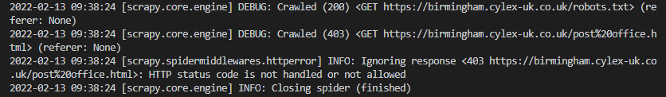

# Company list

## The quest

1. Scrape company details from https://www.cylex-uk.co.uk/
2. Find those companies on https://uk.trustpilot.com/
3. Grab the review summary and a handful of reviews
4. Put them into a database AND an excel file.
5. Send us the results & the code used to get them

## 1. Data from Cylex
Inspected source code on Cylex website. There are two possible places to get company name from:
- url, where company details are:
```
https://birmingham.cylex-uk.co.uk/company/birchfield-cleaning-centre-14236240.html
```
- company name:
slug-like name between the word '/company/' and a 8 digit number. This would require cleaning up to get rid of the '-'
```
<meta itemprop="url" content="https://sinfin.cylex-uk.co.uk/company/blue-elephant-19890236.html"
```
second source of company name - this would give me a clean name with spaces

```
<meta property="og:title" content="Jay C Security Ltd" />
```
third source of company name - clean again, but unsure if all companies will have twitter account
```
<meta name="twitter:title" content="Valerie Ann Newton" 
```
## 2. Error 403 from Cylex

After several attempts I was unable to get company list from cylex. When I run spider I am getting 403 error. For more details check cylex-spider branch.

 Tried to resolve (and failed):
- uncommented 'USER_AGENT' in settings to see if it works, it didn't
- add a random user-agent found as a solution to this error on stack overflow
- commented out crawl spider and add scrapy spider and have it investigate one page, where I know where company details are
- investigated with chrome dev tools what user agent cylex accept. found this one in Request Headers section:
```
Mozilla/5.0 (Linux; Android 6.0; Nexus 5 Build/MRA58N) AppleWebKit/537.36 (KHTML, like Gecko) Chrome/98.0.4758.82 Mobile Safari/537.36
```
- changed spider completly to wikipedia - to check if spider can get into any other website - the wikipedia didn't return 403 error
- installed library 'scrapy-user-agents==0.1.1' to have user agents randomly changed and add to settings:
```
DOWNLOADER_MIDDLEWARES = {
    'scrapy.downloadermiddlewares.useragent.UserAgentMiddleware': None,
    'scrapy_user_agents.middlewares.RandomUserAgentMiddleware': 400,
}
```
- add 'DOWNLOAD_DELAY = 5' in attempt to imitate human behaviour more
- add headers to spider:
```
    # headers = {
    #     'user-agent': 'Mozilla/5.0 (Linux; Android 6.0; Nexus 5 Build/MRA58N) AppleWebKit/537.36 (KHTML, like Gecko) Chrome/97.0.4692.99 Mobile Safari/537.36',
    #     'cookie': 'your cookie',
    # }
    # response = requests.get('https://corby.cylex-uk.co.uk/company/alexs-15659626.html', headers=headers)
```
- and different version to add headers to spider request:
```
    # req = Request('https://corby.cylex-uk.co.uk/company/alexs-15659626.html', headers={'User-Agent': 'Mozilla/5.0'})
    # response = urlopen(req).read()
```
- changed settings 'ROBOTSTXT_OBEY' to False, to test if this was blocking, although the robots.txt file didn't indicate any potential problems, solution didn't work anyway, changed back to True
- set various different settings with cookies:
```
COOKIES_ENABLED = True
COOKIES_DEBUG = True
```

- further area to investigate Proxies
- further to investigate for crawl spider - sometimes when you click onto the company details you get advert pop up, which needs to be closed, before accessing the page

## 3. Yell as alternative to Cylex

Attempt to reaserch another popular website that would give me a lots of record of companies - Found Yell
### Extracting data:

#### Example data:

Below you will find an example of company that has profile on both trustpilot and Yell: 

- Corby Tyre and Exhaust- Yell link [here](https://www.yell.com/biz/corby-tyre-and-exhaust-corby-6915600/)

- Corbytyre - Trustpilot link [here](https://uk.trustpilot.com/review/www.corbytyres.co.uk)

#### Issues:

- the names are different - "corby tyre and exhaust" on Yell, but "corbytyres" on trustpilot - this might be due this one being unclaimed profile at trustpilot
- common ground: they both reffer to the same website of the company link [here](www.corbytyres.co.uk)
- need to be aware that not all companies will have website on both sites
- I tested that trustpilot allows to reaserch by company name OR partial of the website address. It is worth to harvest both data from Yell to get more hits in Trustpilot
- sitemap returning 503 error(more details in [robots.txt](#robots.txt))
- crawling spider can start on the page listing 29 companies and crawl into each company on the list, but doesn't return any data. Gives status 200 and list of each pages it crawled, but no data. Tried for loop through responses, but no result
- company id for Yell seems to be usefull: two ways to obtain it from article:
as id - this one contains 'ad_fle_' and also can contain long number if company aticle is given any additional advertising properties.

```
id="ad_FLE_8852306_-"
```
or cleaned as this below example, but xpath selector doesn't seem to want to take it

```
data-natId="8852306"
```

#### Source of data in Yell:

- exact url where data is:
```
https://www.yell.com/biz/corby-tyre-and-exhaust-corby-6915600/
```

- company name
```
<h1 itemprop="name" class="text-h1 businessCard--businessName" >Corby Tyre and Exhaust</h1>
```

- company website link, this will require cleaning to get just the domain 'corbytyres':
this is found in source code
```
<a itemprop="url" rel="nofollow noopener" href="http://www.corbytyres.co.uk" data-tracking="AP:CN:WL:FLE" target="_blank" class="btn btn-big btn-yellow businessCard--callToAction" >
```
link received by using css selector and xpath
```
https://www.automotivesolutionscorby.com/?utm_source=yell&utm_medium=referral&utm_campaign=yell'
```


#### robots.txt

Robots txt contains links to sitemap. Link to robots.txt for Yell can be found [here](https://www.yell.com/robots.txt)

Robotx.txt contain the list of sitemaps, but the sitemaps return error 503 when I try to look up. The same error is being returned for the spider
```
2022-02-13 14:55:01 [scrapy.downloadermiddlewares.retry] ERROR: Gave up retrying <GET https://www.yell.com/sitemaps.xml> (failed 3 times): 503 Service Unavailable
``` 


## 4. Saving data

In settings.py I added various options to save data in different formats.

### csv
when the code is uncommented, when you runspider the data is saved into companies.csv file

### xlsx

Guidance how to convert csv to xlsx automaticaly using python found [here](https://datatofish.com/csv-to-excel-python/) I installed pandas library and wrote the exact location of the input file and where the new xlsx file needs to be stored. 

VS code doesn't seem to cope with opening xlsx file, I downloaded the file from github and opened it in googlesheets.

### SQLite database

To lookup the content of the *.db file I downloaded the file from github to my computer and used [this page](https://sqliteonline.com/) to open it

## Off topic

Yell has lots of fun background images for page 404

- [404 error background image](https://www.yell.com/img/errorHero-1.jpg)
- [404 error background image](https://www.yell.com/img/errorHero-2.jpg)
- [404 error background image](https://www.yell.com/img/errorHero-3.jpg)
- [404 error background image](https://www.yell.com/img/errorHero-4.jpg)
- [404 error background image](https://www.yell.com/img/errorHero-5.jpg)
- [404 error background image](https://www.yell.com/img/errorHero-6.jpg)
- [404 error background image](https://www.yell.com/img/errorHero-7.jpg)


## Special Thanks to:

- [SelectorGadget - chrome extension](https://chrome.google.com/webstore/detail/selectorgadget/mhjhnkcfbdhnjickkkdbjoemdmbfginb/related?hl=en)

- [linkedin course  - WebScrapping with Python](https://www.linkedin.com/feed/update/urn:li:activity:6897559949699088384/)

- [Python Scrapy tutorial at YouTube (full course 25 videos)](https://youtu.be/ve_0h4Y8nuI)

- AI Global media for the challenge